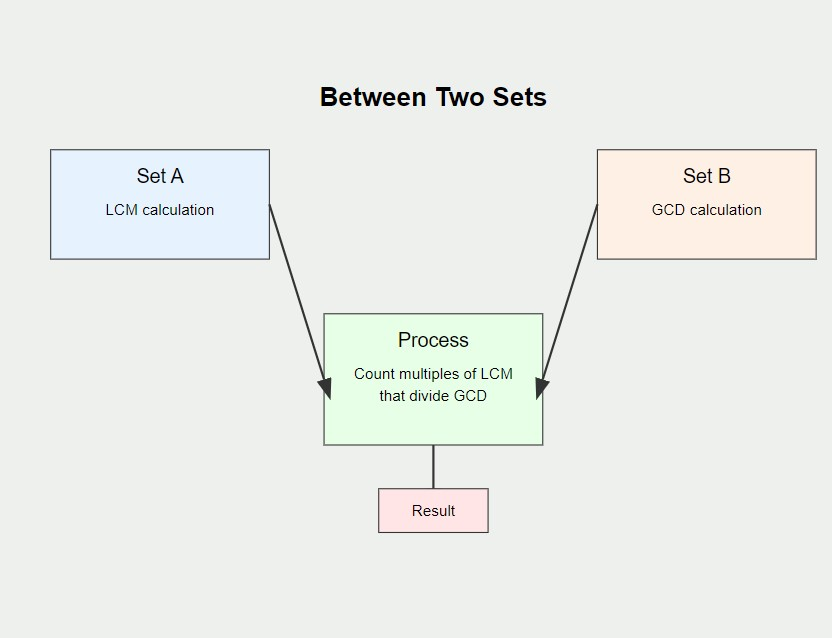
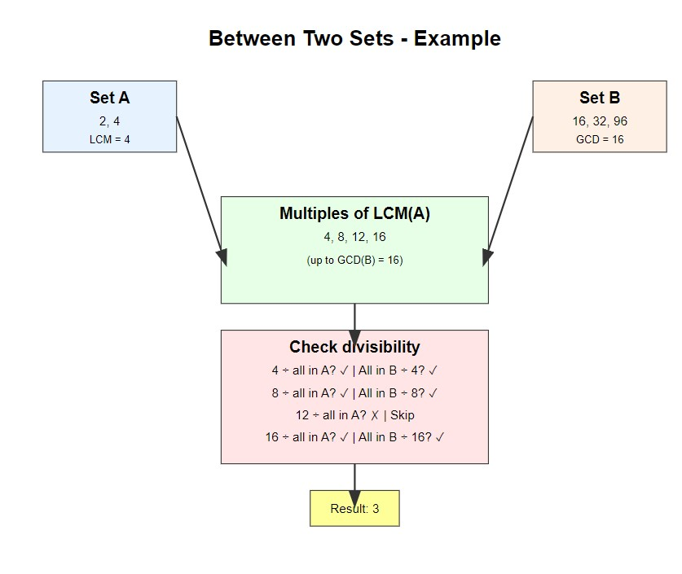

# 📊 Between Two Sets 📊

## 📖 Problem Explanation

The problem "Between Two Sets" asks us to determine how many integers exist between two sets of numbers, `a` and `b`, that satisfy the following two conditions:

1. Every number in set `a` is a factor of the integer (i.e., the integer is divisible by all elements in `a`).
2. The integer is a factor of every number in set `b` (i.e., all elements in `b` are divisible by the integer).

## 📥 Input Format

1. The first line contains two integers, `n` and `m`—the sizes of arrays `a` and `b`.
2. The second line contains `n` space-separated integers representing the elements of array `a`.
3. The third line contains `m` space-separated integers representing the elements of array `b`.

## 📤 Output Format

- Output a single integer representing the number of integers between the two sets that satisfy the given conditions.

## 📊 Examples

### Example 1

#### Input:

```
2 3
2 4
16 32 96

```

**Output:**

```java
3
```

### Explanation

- The numbers between the two sets that we need to check are 4, 8, and 16. These numbers satisfy the following:
  - All numbers in `a` (2 and 4) are factors of 4, 8, and 16.
  - These numbers (4, 8, 16) are also factors of all numbers in `b` (16, 32, 96).

### Example 2

#### Input

```
3 2
3 4 6
24 48

```

**Output:**

```java
0
```

#### Explanation:

In this case, no integer satisfies the conditions.

## 🧠 Approach and Solution





To solve this problem, we follow the below steps:

1. **Find the Least Common Multiple (LCM) of all elements in set `a`:**
   - The LCM of set `a` represents the smallest number that is divisible by every element in `a`. Any number that satisfies the condition of being divisible by all elements of `a` must be a multiple of this LCM.
2. **Find the Greatest Common Divisor (GCD) of all elements in set `b`:**

   - The GCD of set `b` is the largest number that divides all elements in `b`. Any number that satisfies the condition of dividing all elements of `b` must be a divisor of this GCD.

3. **Find how many multiples of the LCM divide the GCD:**
   - Start from the LCM of `a`, and for every multiple of the LCM, check if it divides the GCD of `b`. This ensures the number is both divisible by all elements in `a` and divides all elements in `b`.

### **Steps in Code:**

1. **Calculate LCM of array `a`:**

   - Iterate through the array and calculate the LCM of all elements using the formula:

   ```java
   LCM(a,b)= ∣a×b ∣ /GCD(a,b)
   ```

2. **Calculate GCD of array `b`:**

   - Iterate through the array and calculate the GCD of all elements using the Euclidean algorithm:

   ```java
   GCD(a, b) = {GCD}(b, a \% b)

   ```

3. **Find the numbers between the two sets:**
   - Start from the LCM of `a` and increment by the LCM (since every valid number must be a multiple of LCM).
   - For each such multiple, check if it divides the GCD of `b`.

## 🤗 Contributions

Contributions are welcome! Feel free to create issues or submit pull requests.

## 📧 Contact

For any queries, reach out to Your Name.
