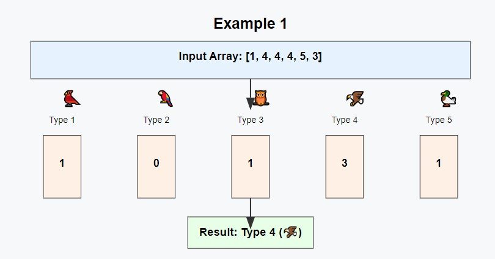
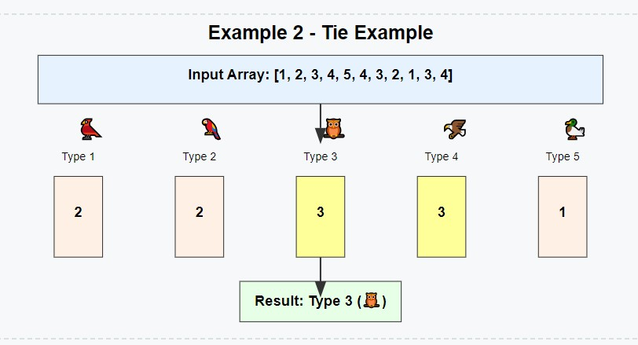

# 🐦 Migratory Birds 🐦

## 📖 Problem Statement

There are `n` birds in a flock, and each bird is identified by an integer representing its species. You want to determine which species of bird occurs most frequently in the flock. If there is a tie, choose the bird with the smallest ID.

### **Input Format**

- The first line contains an integer, `n`, the number of birds.
- The second line contains `n` space-separated integers representing the species of each bird.

### **Output Format**

Print a single integer: the ID of the species that occurs most frequently.

## 📊 Examples

### Example 1

#### Input:

```
6
1 4 4 4 5 3

```

**Output:**

```java
4
```

### Explanation:



- Bird IDs spotted are `[1, 4, 4, 4, 5, 3]`.
- The most frequently spotted bird ID is `4`, which appears `3` times.

### Example 2

#### Input

```
11
1 2 3 4 5 4 3 2 1 3 4

```

**Output:**

```java
3
```

#### Explanation:



- The bird IDs are [1, 2, 3, 4, 5, 4, 3, 2, 1, 3, 4].
- Bird types 4 and 3 both appear 3 times. Since 3 is the smaller ID, it is the answer.

## 🧠 Approach and Solution

- Count the Frequency: Use a frequency map (HashMap or an array for small fixed ranges) to count how many times each bird ID appears.

- Find the Maximum Frequency: Traverse the map or array to find the bird ID with the highest frequency.

- Handle Ties: If multiple bird IDs have the same frequency, select the one with the smallest ID.

**_Solution Steps:_**

1. Frequency Map:

   - Traverse the list and count the frequency of each bird ID.
   - Store the frequencies in a HashMap (or an array since the bird IDs range from 1 to 5).

2. Max Frequency Search:

   - After calculating the frequencies, iterate over the map and keep track of the highest frequency and the corresponding bird ID.
   - If a bird type has the same frequency as the current highest, select the smaller bird ID.

3. Return the Result:

   - Return the bird ID that meets the conditions.

## 🤗 Contributions

Contributions are welcome! Feel free to create issues or submit pull requests.

## 📧 Contact

For any queries, reach out to Your Name.
